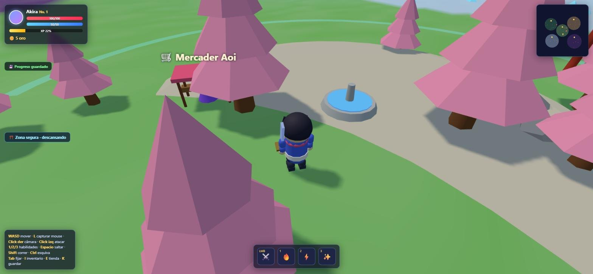

# Aetheria Online

Un action RPG 3D que corre entero en el navegador, en un solo archivo HTML y sin build.

**▶ [Jugar](https://alejodipietro.github.io/aetheria/)** · Escritorio, teclado y mouse.



## Qué hay adentro

- **Cinco zonas** de dificultad creciente, cada una con su terreno, su cielo, su clima y su enemigo: Pradera de Sakura (Nv. 1-5), Bosque Susurrante (6-12), Desierto Ardiente (13-20), Picos Helados (21-30) y Abismo Demoníaco (31-45).
- **Cinco familias de enemigos que pelean distinto**: el slime salta, el kitsune muerde y retrocede, el golem avisa un pisotón en área, el yuki tira carámbanos de lejos y el señor del vacío se teletransporta a tu espalda. Todos avisan antes de golpear, y en ese momento la esquiva vale.
- **Combate con cadena de tres golpes**, esquiva con invulnerabilidad, contador de combo y bloqueo si llevás escudo.
- **Ocho habilidades equipables** en cuatro ranuras, con cinco rangos cada una. Ninguna necesita objetivo fijado: salen hacia donde apuntás.
- **Loot con rarezas** —de Común a ÚNICO— con objetos irrepetibles que sólo sueltan los jefes de zona, cada uno en su arena.
- **Inventario, equipamiento y tienda**: cada pieza equipada recalcula las estadísticas y se ve en el personaje.
- **Ciclo de día y noche** de cuatro minutos, con faroles que se encienden solos en el santuario.
- El personaje está **construido con geometría primitiva y animado a mano**, con sombreado toon y contorno, sin modelos externos ni librería de animación.
- **Sonido sintetizado** con WebAudio: no hay un solo archivo de audio en el repositorio.

## Estado

Es un sandbox de combate y progresión, no un juego terminado: se explora, se pelea, se sube de nivel, se equipa y se arman habilidades, pero no hay historia que seguir. Falta lo que le daría rumbo — NPCs con misiones, una mazmorra y clases.

## Cómo está hecho

Three.js y nada más. Un `index.html` con la escena, el HUD en HTML plano, el bucle de juego y el guardado en `localStorage`, más tres módulos en `js/`: los datos de diseño, la lógica de objetos y el sonido. Sin framework, sin bundler y sin nada que compilar.

Three.js viene versionado en `vendor/` en lugar de pedirse a un CDN. Es más peso en el repositorio, pero el juego no depende de que un tercero siga en pie para arrancar.

## Correrlo local

Necesita un servidor estático, porque los módulos ES no cargan desde `file://`:

```bash
npx serve .
```

## Controles

| Tecla | Acción |
|---|---|
| `WASD` | Mover (relativo a la cámara) |
| `Shift` | Correr |
| `Espacio` | Saltar (dos veces para el salto doble) |
| `Ctrl` | Esquiva (también en el aire) |
| Click izquierdo | Fijar enemigo y atacar (cadena de tres) |
| Click derecho + mover | Orbitar la cámara |
| Rueda | Acercar y alejar |
| `L` | Capturar el mouse |
| `Tab` | Fijar el enemigo más cercano |
| `1` a `4` | Habilidades equipadas |
| `H` | Grimorio (equipar y subir habilidades) |
| `I` | Inventario |
| `E` | Tienda (cerca del mercader) |
| `K` | Guardar |
| `M` | Sonido |
